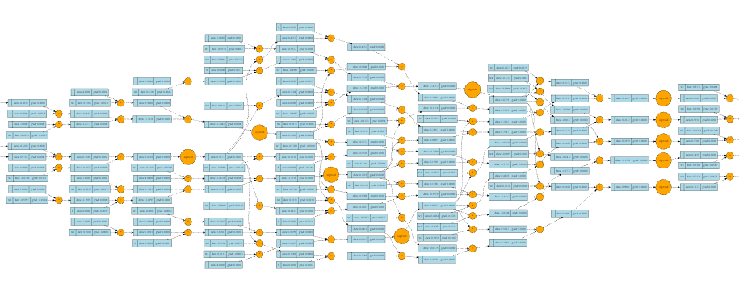

# ScalarFlow

This project is a simple neural network library implemented from scratch in Python. It provides a framework for building and training neural networks using a custom auto-gradient engine. The library includes classes for defining neural network layers, neurons, network mode and for visualization of networks and their gradients. Supports common activation functions like sigmoid, tanh, and relu.

## Features

- Implementation of a custom auto-gradient engine for automatic differentiation.
- Definition of neural network layers with customizable activation functions.
- Support for common activation functions: sigmoid, tanh, and relu.
- Training loop using gradient descent optimization algorithm.
- Visualizations of computation graphs using Graphviz.

## Dependencies
The neural network library has the following dependencies:

- Python (>=3.6)
- Graphviz (for visualization)

## Usage

-Import the necessary modules and classes.
-Define your mathematical expressions using the value class from the autograd engine.
-Create your neural network model by composing layers and neurons from the neural network library.
-Train your neural network using the provided methods for different loss functions.

Autograd Engine
'''python
# Example usage of the autograd engine
from scalarflow.engine import value

# Create value objects
a = value(2)
b = value(3)

# Perform arithmetic operations
c = a + b
d = a * b

# Compute gradients
d.backward()

# Print results
print("c =", c)  # Output: c = value(data = 5, grad = 1)
print("d =", d)  # Output: d = value(data = 6, grad = 2)
'''python

Neural Network Library
'''python
# Example usage of the neural network library
from scalarflow.nn import network

# Create a neural network model
model = network(num_in=2, layer_sizes=[4, 2, 1], unit_activation='relu')

# Print the network architecture summary
model.summary()

# Train the model
inputs = [[0, 0], [0, 1], [1, 0], [1, 1]]
outputs = [[0], [1], [1], [0]]

model.fit(inputs, outputs, epochs=100)

# Make predictions
predictions = model.predict(inputs)
print(predictions)
'''python
